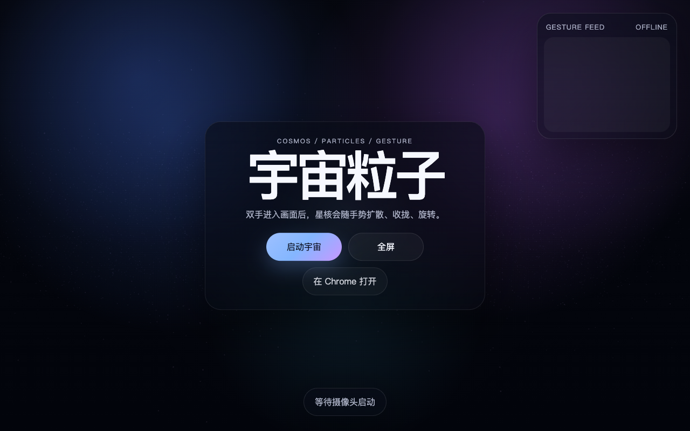

# Particle Gesture Sphere

An interactive `Three.js + MediaPipe Hands` experiment where a bright particle sphere floats in the middle of a live camera feed and reacts to hand gestures in real time.

This project was built iteratively with **OpenAI Codex** inside the Codex desktop app, combining direction, visual refinement, and code generation into one workflow.

## Preview



- Live demo: [thnanyawongs-netizen.github.io/particle-gesture-sphere](https://thnanyawongs-netizen.github.io/particle-gesture-sphere/)
- Demo recording: [assets/demo.mov](./assets/demo.mov)

## What It Does

- Uses the webcam as the full-page background
- Renders a dense glowing white particle sphere in the center
- Detects hand landmarks with MediaPipe Hands
- Explodes the sphere when the user opens a palm
- Re-forms the sphere when the user makes a fist
- Lets the sphere follow the fist position
- Rotates the sphere with index-finger motion
- Triggers a full spin when the index finger swipes left quickly

## Why This Repo Exists

This repository packages the interaction as a clean, shareable demo rather than a one-off local experiment. It is meant to be easy to clone, run, study, and extend.

It also shows a practical example of a **Codex-assisted creative coding workflow**:

- concept direction
- visual iteration
- interaction tuning
- implementation
- packaging for open-source release

## Built With

- `Three.js`
- `MediaPipe Tasks Vision`
- native `WebGL`
- native `getUserMedia`

All runtime dependencies are loaded from CDNs. There is no build step and no npm install required for the current version.

## Interaction Model

- **Open palm**: explode the particle sphere outward
- **Fist**: gather particles back into the sphere and move it with the hand
- **Index finger drag**: rotate the sphere
- **Fast left swipe with index finger**: spin the sphere a full turn

## Run Locally

Start a static server from the repository root:

```bash
python3 -m http.server 4010
```

Then open:

```text
http://localhost:4010
```

Use **Google Chrome** for the most reliable webcam behavior.

## Files

- `index.html` — page structure and UI shell
- `styles.css` — layout, glass UI, and presentation styling
- `main.js` — Three.js scene setup, particle simulation, gesture logic, and animation loop
- `TECH.md` — technical notes and architecture overview
- `assets/preview.png` — repository preview image
- `assets/demo.mov` — short recording of the interaction

## Notes

- Webcam access requires `localhost` or HTTPS
- Some embedded browsers and WebViews may block or weaken camera permissions
- Chrome is the recommended browser for testing and demos

## Built With Codex

This project was not only coded in JavaScript. It was also shaped through repeated back-and-forth iteration with Codex:

- refining the visual direction
- tuning gesture behavior
- adjusting particle density, scale, glow, and motion
- restructuring the project for a public GitHub release

If you are exploring AI-assisted frontend or creative coding workflows, this repo is intended as a concrete example of that process.

## Possible Next Steps

- make the sphere feel more volumetric and planet-like
- add stronger bloom, trails, or post-processing
- add two-hand interactions
- move more of the particle behavior into shaders
- publish a live demo with GitHub Pages or Vercel
